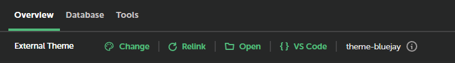

# External Themes Add-on

A Local add-on that allows you to add external theme folders to your WordPress sites using symbolic links. This keeps your theme code out of the Local environment ensuring it never gets overwitten when pulling changes. Perfect for cloning theme repositories from Git into a different folder, especially if the production theme code is different from development such as when using automation to bundle the theme.

## Features

- **🔗 Symbolic Link**: Creates symbolic links between external theme folders and WordPress themes directory.
- **📁 Theme Picker**: Easy folder picker to select your external theme directory.
- **🔄 Relink**: Button to manually recreate the symbolic link should it get deleted.
- **⚡ Auto Link**: Every pull in Local triggers the link to be recreated and auto activates the theme.
- **💻 Developer Tools**:
    - Open theme folder in VS Code
    - Open theme folder in native file explorer

## How It Works

1. Click the "Select Theme" button and choose your theme folder.
2. It will automatically link the theme to the site and activate the theme.
3. On every Local "Pull" it will fix the link and reactivate the theme.
4. Relink button incase you need to quickly manually recreate the symlink.
5. Easily work on your theme with the open in VS Code button.

## Use Cases

- **Theme Development**: Work on themes in a centralized location outside of WordPress
- **Version Control**: Keep themes in Git repositories separate from WordPress sites
- **Multi-Site Development**: Use the same theme across multiple Local sites
- **Backup Safety**: Theme files stay in your preferred backup location

## Installation

### Local Add-on Directory
Add-on directories must be placed or linked into the Local add-ons directory to appear within the Local application. The generator will create a symlink in the Local add-ons directory pointing to your add-on by default; if you skip this step, you will need to link the directory manually.

### Local add-on directories:

macOS: ~/Library/Application Support/Local/addons
Windows: C:\Users\username\AppData\Roaming\Local\addons
Debian Linux: ~/.config/Local/addons

### Add Add-on to Local

1. Clone repo either into the addon path or symlink it
2. `npm install` (install dependencies)
3. `npm run dev`
4. Open Local and enable add-on

## Development

### External Libraries

- @getflywheel/local provides type definitions for Local's Add-on API.
    - Node Module: https://www.npmjs.com/package/@getflywheel/local-components
    - GitHub Repo: https://github.com/getflywheel/local-components

- @getflywheel/local-components provides reusable React components to use in your Local add-on.
    - Node Module: https://www.npmjs.com/package/@getflywheel/local
    - GitHub Repo: https://github.com/getflywheel/local-addon-api
    - Style Guide: https://getflywheel.github.io/local-components

### Folder Structure

All files in `/src` will be transpiled to `/lib` using [TypeScript](https://www.typescriptlang.org/). Anything in `/lib` will be overwritten.

### Development Workflow

If you are looking for help getting started, you can consult [the documentation for the add-on generator](https://github.com/getflywheel/create-local-addon#next-steps).

You can consult the [Local add-on API](https://getflywheel.github.io/local-addon-api), which provides a wide range of values and functions for developing your add-on.

## License

MIT
